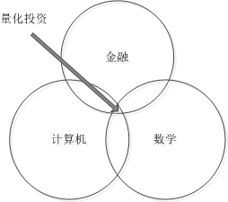
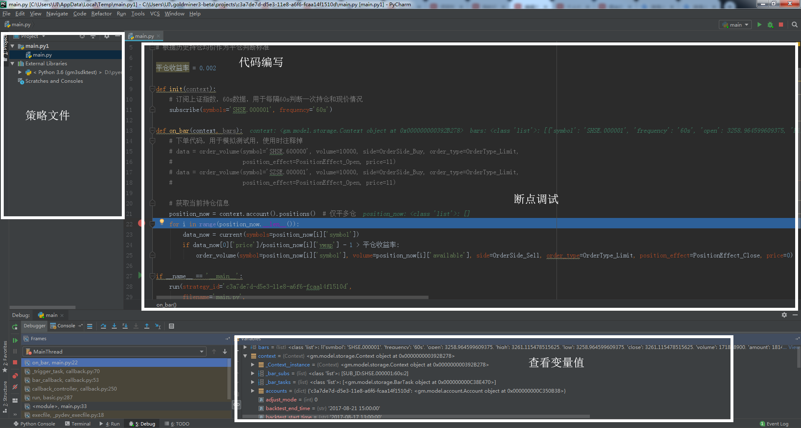
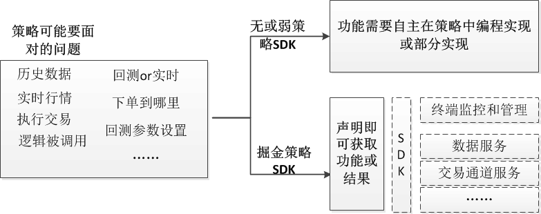
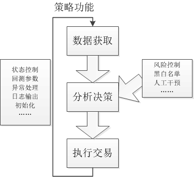
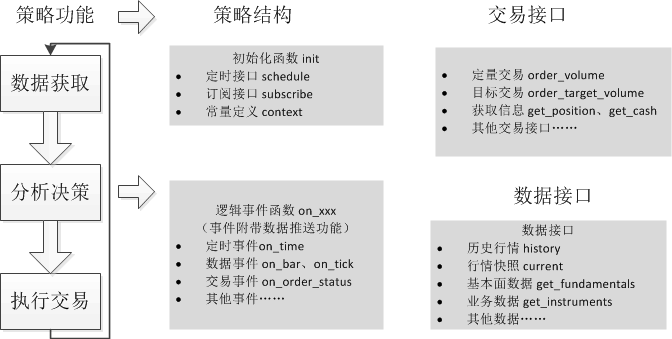
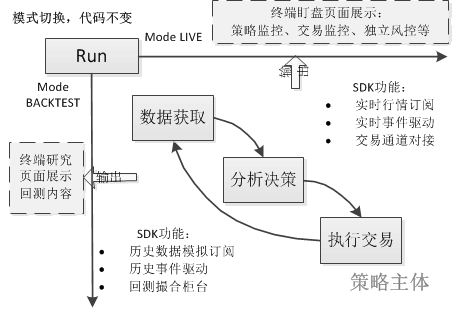
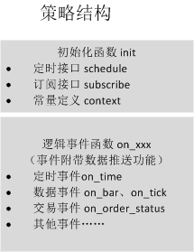
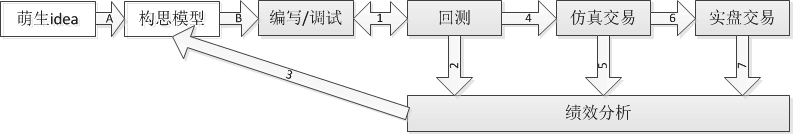
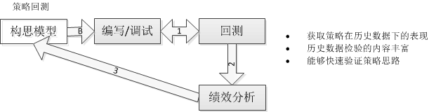
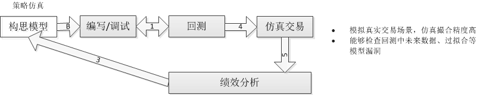

# 策略指引（30分钟入门东方财富量化策略）

**概述 **

本指引从如何使用东方财富量化策略编写角度，帮助入门者快速熟悉策略的一般编写要素，熟悉东方财富量化策略体系，进而能够在东方财富量化中独立构建策略并进行优化和交易。
代码部分多以伪代码表述，具体代码编写参照各语言的api说明

## 策略编写必要基础

### 知识&技能储备

量化投资作为金融、计算机、数学的交叉应用领域，量化策略对个人知识和技能有一定要求，至少需要:

- 证券知识：需要了解证券的交易规则、证券分析基本原理

- 计算机编程：熟悉至少一门计算机语言，熟悉数据结构、能够处理数据、能够编写运算公式和逻辑

- 数学知识：统计学、高等数学、金融时序数据处理等知识



说明：以上仅供参考，知识、技能和学习路线可以在东方财富量化论坛或其他学习网址学习和准备

### 编写环境准备

量化策略的编写，通常在**程序开发环境**中结合**策略接口**完成，因此首先要准备合适的**程序开发环境**和**策略接口**

#### 策略开发环境

东方财富量化策略语言环境依托于**常用的计算机语言**，比如python策略可使用pycharm集成开发环境、matlab策略需要matlab开发环境，习惯的开发环境能够提高编程效率、便于修复策略bug



#### 策略接口

策略接口可以比作是策略的承载容器，东方财富量化策略接口(**pythonSDK，matlab，C++和C#**)以插件形式提供。面向策略时，以标准接口方式供策略直接调用，保证策略简单和稳定，而在SDK内部处理许多繁琐的逻辑，包括处理数据、切换运行模式、连接终端等



### 策略基本要素

策略基本功能可拆解为：**获取数据、分析决策、执行交易**三个要素

- **获取数据·** 数据（包括行情数据、基本面数据）包含了市场信息，根据有效市场假说，弱有效市场下，历史数据信息有助于有利决策。因此，数据获取可看做量化策略的基础要素

- **分析决策·** 分析决策的作用是找出市场的规律，做出正确决策。主流决策分为择时（选择最佳的买卖时机）和选股（选择最优价值的投资组合），当然，量化分析手段千姿百态，并无固定模式。

- **执行交易·** 交易是实现策略价值的必经手段，但又不局限于单纯的实现，其中括仓位管理、止盈止损等让收益和风险趋于平衡

**策略也会包含其他功能**：如风险控制、标的黑白名单、人工干预因子等
**也会包含策略状态控制**：回测参数、异常情况处理、日志信息输出、初始化等系统功能，以保持策略的稳定运行



## 用东方财富量化编写策略

策略的编写就是将**一个投资决策思路以代码的形式组织，使之在计算机自动执行**
策略的组织形态可以是多种多样的，目的是能够高效执行投资思路，但是如果能有成熟编写套路或者模板，就能够帮助QUANT快速梳理出策略组织思路，提高编写效率和后期的优化效率！
以下介绍东方财富量化接口功能为例，以伪代码（示意但不是真的这么写）的方式，说明策略功能的实现方式和优缺点



### 获取数据

数据是决策和分析的基础，数据的速度、完整性非常重要
东方财富量化提供两大类数据获取方式：订阅数据获取实时数据、接口直通获取历史数据

#### 通过订阅获取高频行情数据

**描述**
预先订阅所需数据，在使用时，用对应的事件函数接收数据，数据发生更新时返回，并能够返回指定格式的时间序列滑窗数据。如：

```
# 第一步：订阅函数（参数规格）
subscribe(标的列表，数据频率，数据序列长度);

# 第二步：接收函数标识（全局变量，指定数据返回）
On_event (全局变量，指定数据集);
    print (指定数据集)
    print (全局变量)

```

**模式说明**
返回结果跟随策略模式（关于模式会在后续详细说明）

**处理原理**

1. 预先将需要的数据参数，通过subscribe订阅接口传至服务器

2. 服务器建立一个持久的订阅服务

3. 当数据更新时将数据主推返回，并在本地组织成预先设定的数据格式

4. 返回的数据存放在context.data中，并按照频率、品种、字段分类存放

**优点**

- 高频方式下，数据返回延时低

- 在历史模式下，订阅服务数据推送由本地预先取到全量历史数据按时间分段返回来模拟

- 数据格式规整，可获取指定长度的时间序列数据

**缺点**

- 只有日频以内的行情数据支持订阅模式
— 使用方式不如接口方式灵活，只能按固定频率向后递推

**适用场景**

- 高频次、规则行情数据的处理，在高频实时行情接收、策略回测时性能高

**示例**

```
# 订阅平安银行10个长度1分钟的bar数据，然后求收盘价均值
# 通过订阅将需要的数据申明
subscribe(symbols='SZSE.000001', frequency='1m', count=10)

# 通过on_bar函数接收bar数据事件，并在该函数中求均值
on_bar(context,bar)
    mean(context.data（symbols='SZSE.000001', frequency='1m'，fidels=’close’）)

```

#### 通过接口获取数据

**功能**

- 财务数据（收录了上市公司各季度财务报表数据）

- 历史行情数据（最近的tick数据，较长时间的bar数据）

- 证券基本信息（涨跌停、停复牌、最小变动价位、保证金比例等）

- 指数成分

- 交易日历

**描述**
通过接口返回值获取数据，数据仅返回一次，如：

```
# 数据返回=请求函数（参数规格）

# 查询历史行情数据：获取指定时间段内的历史数据
history(标的，频率，开始时间，结束时间，是否复权)

# 查询基本面数据类：获取指定时间段内的历史数据
get_fundamentals（表名，字段名，标的，开始日期，结束日期）

# 查询成分股：获取指数成分股
get_constituents（指数代码）

# 查询业务数据：获取交易日期列表
get_trading_dates（交易所，开始时间，结束时间）

```

**处理方式**
函数、参数、直连服务器，服务器响应后将数据返回

**模式**
直连服务器，无模式

**优点**

- 可获取的数据种类多，使用场景灵活

- 一次性返回较大数据量

- 可直接获取指定数据

**缺点**

- 和服务器往返交互，高频调用时对网络和服务器状态依赖大，效率不高

- 策略历史模式运行时容易引入未来数据，导致回测失真

**适用场景**
低频次，大数据量的数据获取

**示例**

```
# 查询行情快照
current_data = current(symbols='SZSE.000001')

# 查询历史行情数据，并以结构方式返回
history_data = history(symbol='SHSE.000300', frequency='1d', start_time='2010-07-28',  end_time='2017-07-30', df=True)

# 查询财务数据，在股票交易衍生表中查询几个字段的值
get_fundamentals(table='trading_derivative_indicator', symbols='SHSE.600000, SZSE.000001', start_date='2017-01-01', end_date='2017-01-01',  fields='TCLOSE,PETTMNPAAEI')

```

### 分析决策

当策略做决策时，需要处理以下问题：

- 策略中决策的类型有哪些？

- 不同类型的决策逻辑如何被自动的调用？

- 怎么更快速的让决策逻辑介入待决策事件？

- 决策逻辑如何获取待决策数据？

东方财富量化策略接口通过**事件**驱策略中的动分析决策：

- 会将常用的决策分类为几类事件，如：数据分析决策，交易回报决策，定时接口等

- 当事件发生时，对应的事件函数会被自动调用，如：数据到达时，交易回报返回时，定时被调用

- 调用方式通过专有程序监控，及时执行对应事件函数，并将事件内容当做参数传入

#### 定时决策

**处理方式**
预先通过schedule配置定时任务函数，配置的定时函数将在指定的时间被执行

**模式**
跟随策略模式

**优点**
直接指定运行时间，使用场景灵活

**缺点**
行情的更新时间和本地时间是不一致的，容易错失重要行情的信息

**适用场景**
一般用于低频定时执行，比如盘前选股，尾盘定时交易

**示例**

```
定时每天早上9:30执行algo函数
启动定时
schedule(schedule_func=algo, date_rule='1d', time_rule='9:30:00')
执行定时
algo(context):
定时执行的函数内容

```

#### **事件发生时决策**

**处理方式**
指定事件发生时触发专用事件函数。
事件类型由SDK提供，事件的内容作为入参传入。
函数包括：

- 行情更新事件bar（tick），

- 成交回报事件execrpt，

- 处理委托order

- 系统连接异常事件

**模式**
跟随策略模式

**优点**
响应速度快，方便设置专门逻辑对事件进行处理

**缺点**
事件的类型为预先设定，类型有限；过高频的触发可能导致拥堵，需要预先考虑事件的处理速度量级

**适用场景**
要求及时处理的事件，比如行情更新，订单成交等

**示例**

```
下单
order_volume()
回报事件函数
on_execution_report(成交回报)
    撤单
order_concel（cl_ord_id）

```

### 执行交易

执行交易功能不仅要包含基本的**自动交易功能**，还需要能够支持策略完成**订单管理**、**资金管理**和**持仓管理**功能，这样量化策略才能够全权接手交易大权

#### 交易接口

**处理方式**

- 将不同品种、多种场景统一的交易接口

- 返回统一格式的委托信息

- 委托通过系统主键cl_ord_id唯一标识，可直接用于查询和撤单入参

**模式**
跟随策略模式
自动接入不同交易通道：回测、仿真、实盘

**优点**
下单格式统一（跨品种，跨模式，跨柜台）

**适用场景**
关于交易的所有功能：下单、撤单、委托查询、回报查询

**示例**

```
# 定量委托(依次解释为：标的，委托量，委托方向，委托类型（市价/限价），仓位类型（多仓/空仓），价格)
order_volume（symbol='SHSE.600000', volume=10000, side=OrderSide_Buy, order_type=OrderType_Limit, position_effect=PositionEffect_Open, price=11)

# 定价值委托
order_value（symbol='SHSE.600000', value=10000, side=OrderSide_Buy, order_type=OrderType_Limit, position_effect=PositionEffect_Open, price=11）

# 目标持仓委托
order_target_volume（symbol='SHSE.600000', volume=10000, order_type=OrderType_Limit, position_effect=PositionEffect_Open, price=11）

# 查询委托
get_orders()

# 撤单（cl_ord_id唯一标识）
order_cancel(cl_ord_id)

```

#### 账户查询

**处理方式**
提供账户查询、资金查询、持仓查询接口

**模式**
跟随策略模式
自动接入不同交易通道账户：回测、仿真、实盘

**优点**
提供统一的策略查询接口

**适用场景**
查询可资金：总资产、可用金、保证金、冻结资金……
查询持仓：持仓成本、持仓价格、可用持仓……

**示例**

```
# 查询资金
cash=cash（）

# 查询持仓
positions=positions（）

```

### 策略范式

东方财富量化策略的基本范式是东方财富量化策略平台约定的一些规则，这些规则在尽量遵照交易所规定、行业规范、约定俗成的基础上，使东方财富量化平台更加简化、通用和灵活，熟悉这些规则能够帮助QUANT了解东方财富量化平台的逻辑架构，快速在平台上完成量化策略

以下是东方财富量化中重要范式及解释：

| 名称 | 类型 | 说明 |
| --- | --- | --- |
| run | 函数 | 策略启动入口函数 |
| main | 函数 | 用于策略编写的主文件名，可通过run函数中的filename指定 |
| strategy_id | 参数 | 策略id，用于终端识别策略身份的唯一标识 |
| token | 参数 | 登录身份信息的标识，服务器通过该标识识别账户 |
| mode | 参数 | 策略运行参数，通过在run函数指定mode：MODE_LIVE(实时)=1，MODE_BACKTEST(回测) =2 |
| init | 函数 | 策略初始化函数 |
| context | 全局变量 | 系统默认的全局变量名，可用于：获取订阅的时序数据、系统参数、自定义全局变量 |
| log | 函数 | 实时运行时可以将日志输出到终端监控页面 |
| on_xxx | 函数 | xxx表示事件名，系统提供多种常用的决策事件共策略调用：数据事件、定时事件、交易事件、异常事件等 |
| symbol | 参数 | 标的参数，标的格式为：交易所.代码，如深交所平安银行，‘SZSE.000001’ |
| frequence | 参数 | 数据频率，支持格式为：‘60s’，‘300s’，‘900s’，‘1d’ |
| fields | 参数 | 数据字段，用于选定返回数据的字段 |
| adjust | 参数 | 复权模式，用于指定历史行情数据的复权模式 |
| bar | 数据结构 | 对应K线的Bar(一根蜡烛节点，是该段时间内tick的统计)，其中包含开高低收量等统计信息 |
| tick | 数据结构 | 对应交易所的tick数据（推送频率取决于交易所），不同交易所的tick数据流解析为相同规格的数据 |
| cl_ord_id | 参数 | 订单数据的主键，通过该主键撤单和识别订单，在下单函数调用成功时自动生成 |

### 策略的一般组织形式



#### 策略运行函数run

策略运行函数的作用是**策略运行控制**，可看做是无关策略逻辑内容的系统功能设置

东方财富量化中运行函数一般为run函数，其中包括

| 参数 | 作用 |
| --- | --- |
| strategy_id | 策略id，用于终端识别策略身份的唯一标识 |
| filename | 指定策略主函数的名称 |
| mode | 策略运行模式，MODE_LIVE(实时)=1，MODE_BACKTEST(回测) =2 |
| token | 登录身份信息的标识，服务器通过该标识识别账户 |
| backtest_start_time | 回测开始时间 |
| backtest_end_time | 回测结束时间 |
| backtest_initial_cash | 回测初始资金 |
| backtest_transaction_ratio | 成交比率，最大成交量占比，用于防止不切实际的成交量 |
| backtest_commission_ratio | 回测交易手续费，仿真的在终端设置 |
| backtest_slippage_ratio | 回测滑点，用于模拟冲击成本 |
| backtest_adjust | 复权方式，采用复权撮合可以不用盘后结算，速度更快，但是价格和当时价格不一致，ADJUST_NONE(不复权)，ADJUST_PREV(前复权)，ADJUST_POST(后复权) |
| backtest_check_cache | 回测缓存，回测一次后数据就回被缓存起来，重复回测更快 |
| serv_addr | 终端地址，默认情况下无需设置，SDK运行无法脱离终端（很多动态资源是终端在管），需要指定一个登陆状态的终端 |

#### 策略主体函数

策略主体函数是由自己编写，一般策略的组成结构如下



参照上图和前文介绍，以均线突破指标策略为例，组织一个五脏俱全的简单策略
注意：以下代码仅用于说明逻辑，不能用于任何一门语言的实际运行
文件名：main.xxx

```
%% main函数作为默认的策略编辑函数
function [Context] = main(Context,Event)

%%  首行注释一般用于说明该段策略代码的功能、逻辑等
% 策略名：均线突破策略
% 第一步：设定交易股票池，订阅股票池数据，分别针对个股做以下决策
% 第二步：60分钟均线突破3日均线作为指标
%             如果向上突破，且无持仓，则按一定资金比例买入
%             如果向下突破，且有持仓，则卖出所有持仓
% 第三步：止损指标，判断持仓时间，如果超过两天，就平仓了解

if Event.初始化                                                       % 初始化操作
    股票池 = 'xxxxx'                                                  % 设定股票池
    subscribe(symbols, '1分钟数据',长度20);                            % 订阅数据
    subscribe(symbols, '1天数据',长度10);
    Context.周期1 = 20;                                                % 设定均线周期
    Context.周期2 = 10;
end

周期1=Context.周期1;
周期2=Context.周期2;
1分钟时序数据 = Context.data.1分钟数据.收盘价(周期1);
1天时序数据 = Context.data.1天数据.收盘价(周期2);

if  Event.1分钟数据更新时
    % 计算突破因子
    突破因子 = mean(1分钟时序数据）-mean(1天时序数据 );
    资金= get_cash();
    仓位 = get_position();
    for i = 所有股票循环
        % 60分钟均线突破3日均线作为指标
        if 突破因子(i)>0
            if 持仓.数量==0           %没有仓位则开仓
                订单对象=order_value(标的, 资金*0.1,  买入, 市价,开仓,价格);
            end
        else
            if 持仓.数量~=0                                                % 有仓位则平仓
                订单对象=order_value(标的, 持仓.数量,  卖出, 市价,平仓,价格);
            end
        end
        % 止损指标
        if Context.now-仓位.时间>2天 且 持仓.数量~=0
            订单对象=order_value(标的, 持仓.数量,  卖出, 市价,平仓,价格);
        end
    end

end

```

## 用东方财富量化优化策略

策略优化的目的在于提高策略的决策能力，直观表现为提高策略的交易绩效。一般通过历史回测、实时仿真结合绩效分析手段，反复优化策略模型，达到提高策略决策能力的目的

东方财富量化中策略的优化流程



**A和B过程是非东方财富量化平台的思路构建过程**

A：思路-模型化过程，模型的构建就是要尽可能的完整的表示思路。策略idea萌生时，一般是模糊、带有主观经验的概念，需要理清思路，运用建模技巧、数学知识组织成一个完整的推理过程，且会是一个反复推到重建的优化过程。
B: 模型-代码，是将模型思路转化为计算机逻辑的过程，和人的一般思维有区别，计算机局限于顺序、判断、循环组成的逻辑流，需要一定的编程实现能力

**1-7过程是东方财富量化平台上的策略构建和优化的过程**

1. 

**策略调试过程**，东方财富量化平台的回测、实时模式一致性便利下，策略编写和调试一般在回测模式下进行，反复调试，直到策略能够完整的实现模型内容且能够顺畅运行

2. 

**回测-分析过程**，东方财富量化回测服务将历史数据按时间切片模拟真实数据返回给策略，策略获取数据、分析决策、执行交易后，经回测柜台进行模拟撮合和结算，再将结果返回给策略，模拟一个完整的投资行为。最终的交易信息会输出到绩效服务，得到历史区间内的交易绩效报告

3. **分析-优化过程**，根据交易绩效报告，了解策略的交易详情、收益变化、资金利用、风险敞口，风格偏向等特征作为策略优化的方向，完善策略逻辑



说明：1-2-3-B过程称为回测优化过程，该过程用于验证模型的有效性，对模型进行粗优化。在东方财富量化中，这部分功能在策略研究中通过SDK+本地回测+绩效分析可一键完成

**优点：**

- 获取策略在历史数据下的表现

- 历史数据检验的内容比较丰富

- 能够快速验证策略思路

**缺点：**

- 历史数据的效果不能完全代表未来

- 回测优化中经常存在过拟合、未来数据等干扰因素

- 回测中速度和精度难以共存，粗精度回测结果失准

- 回测中冲击成本、流动性等问题无法模拟

4. **仿真-分析过程**，该过程是策略实盘前精度最高的策略有效性检验。在东方财富量化中，策略仿真运行需要切换策略运行模式并绑定仿真账户。仿真交易使用实时行情盘口撮合，撮合更加精确。


说明：4-5-3-B过程称为仿真优化过程，该过程用于检验模型在当前行情下的有效性，对模型进行精细优化。在东方财富量化中，这部分功能在仿真交易中通过仿真柜台+绩效分析+盯盘页面完成，模拟真实交易场景

**优点：**

- 模拟真实交易场景，仿真撮合精度高

- 能够检查回测中未来数据、过拟合等模型漏洞

**缺点：**

- 仿真数据同步实时数据，数据样本小，模型优化耗时

- 仍然不能解决冲击成本和流动性问题

注意：回测和仿真中都不能解决冲击成本和流动性的问题，所超高频策略（1s级）和超大单策略（总额占当日成交量20%以上）的策略模拟效果会失真，使用时应尽量避免此类策略

5.** 实盘-分析过程**，实盘交易过程,在东方财富量化中实盘的机制有所不同，但形式和内容和仿真保持一致

说明：6-7-3-B过程为实盘交易过程，该过程会暴露策略所有的问题，当然也会承受真实损失。在东方财富量化中，这部分功能和仿真中的使用完全一致

     [ ** ](guide.html#系统管理) [ ** ](559.html#策略编写必要基础)
