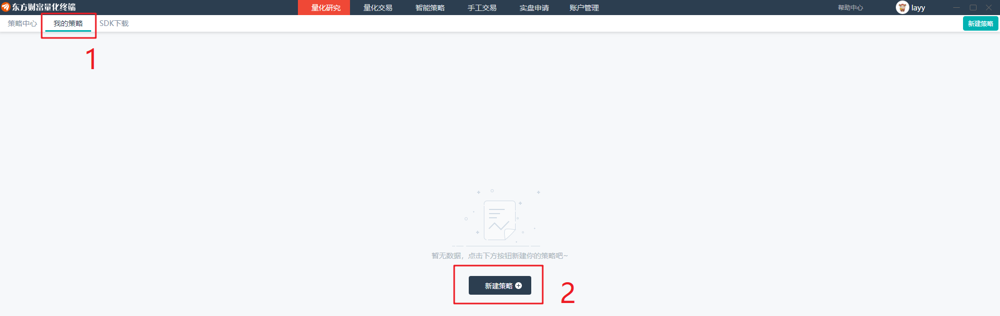
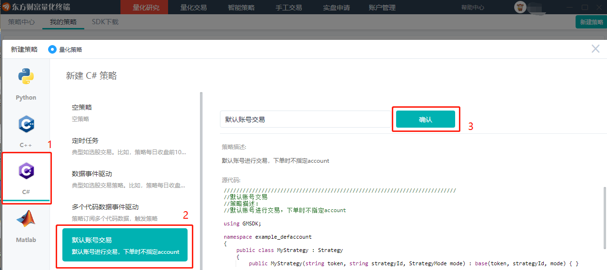
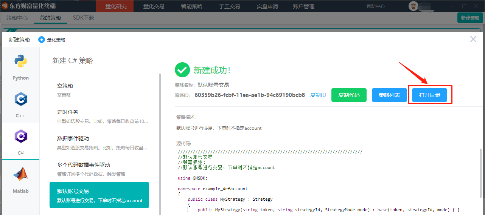
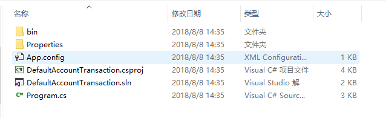
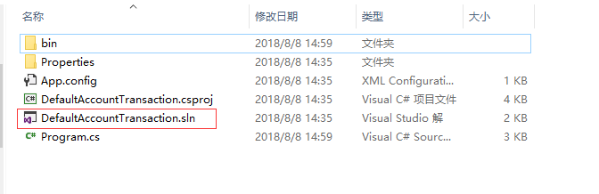
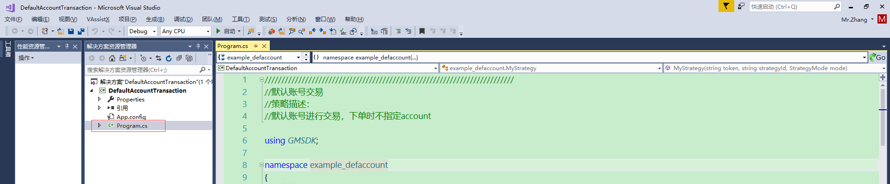
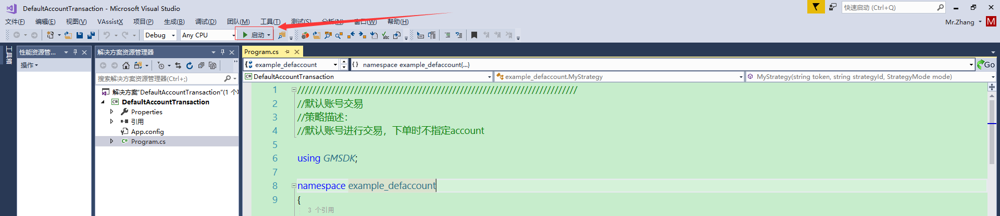
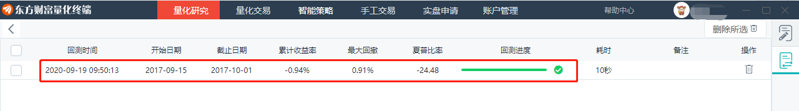
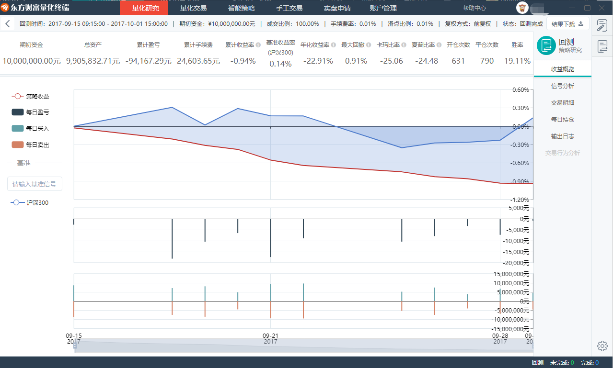

## 指引

### 快速新建策略

- 下载东方财富量化终端

- 

打开终端后，登陆东方财富量化账号点击研究策略，新建策略 或者点击右上角新建策略


- 

新建一个典型默认账户交易策略 新建C#的默认账户交易策略


### 编译策略

- 打开新建策略文件目录 策略文件目录内容可以拷贝到本地其他盘符也可以进行编译生成




- 打开工程文件 sln 文件
需要用 **visual studio** 打开工程文件 (**注意：visual studio 2013及以下版本需安装.net framework 4.5.2**)


- 

编写策略
打开Program.cs文件，可进行策略编辑


编译并运行策略


- 

查看运行结果
东方财富量化客户端中关闭新建策略窗口并打开回测结果列表


查看回测结果


回测相关数据指标


### 获取 SDK

- 通过网页下载 sdk安装包:  [C# SDK](https://www.myquant.cn/download/sdk?lang=csharp)

- 

或者通过 NuGet 方式安装 SDK

  - 

方式一：visual studio

  - 

项目->管理 NuGet 程序包->浏览

  - 搜索 gmsdk-net, `32位`选择**gmsdk-net-x86**, `64位`选择**gmsdk-net-x64**

  - 

选择最新版，安装

  - 

方式二：程序包管理器控制台

32 位

```
PM> Install-Package gmsdk-net-x86

```

64位

```
PM> Install-Package gmsdk-net-x64

```

**注意：**
根据策略选择32位或64位版本`切勿混装`

### 建立我们第一个策略

- 打开Visual Studio新建空白工程并新建源码文件

- 工程中引用 **gmsdk-net.dll**

- 

引入命名空间：GMSDK

```
using GMSDK;

```

- 

将 **gmsdk.dll**, **protobuf-net.dll**放到策略执行文件所在目录

### 策略应该是这样的

- 继承策略基类

- 重改关注事件

- 在OnInit里订阅行情，初始化

- 在main方法中实例化一个派生类对像

- 设置token,策略id,和mode

- 开始运行

### 继承策略基类

```

public class MyStrategy: Strategy
{
    public MyStrategy(string token, string strategyId, StrategyMode mode) : base(token, strategyId, mode) {}
}

```

### 重改关注事件

```
public class MyStrategy: Strategy
{
    public MyStrategy(string token, string strategyId, StrategyMode mode) : base(token, strategyId, mode) {}

    //重写OnInit事件，进行策略开发
    public override void OnInit()
    {
        Console.WriteLine("OnInit");
        return;
    }
}

```

### 在OnInit里订阅行情，初始化

```
class MyStrategy :public Strategy
{
    public MyStrategy(string token, string strategyId, StrategyMode mode) : base(token, strategyId, mode) {}

    //重写OnInit事件，进行策略开发
    public override void OnInit()
    {
        Console.WriteLine("OnInit");
        Subscribe("SHSE.600000", "tick");
        return;
    }
}

```

### 在main里实例化一个派生类对像

1. 获取token：打开客户端->点击右上角用户头像 -> 系统设置 -> 复制token  

2. 获取策略id：打开客户端->策略研究->右上角新建策略->新建C#策略->复制策略ID

3. 策略模式：

  - MODE_LIVE

  - MODE_BACKTEST

```
MyStrategy s("27cbdfd8cd9b86dea554a5612baa4a8eee51af79", "536f1097-8b27-11e8-b6af-94c69161828a", StrategyMode.MODE_LIVE);

```

### 开始运行

```
s.Run();

```

### 订阅行情策略示例

#### 源文件

```
using GMSDK;

namespace example
{
    public class MyStrategy : Strategy
    {
        public MyStrategy(string token, string strategyId, StrategyMode mode) : base(token, strategyId, mode) { }

        //重写OnInit事件，进行策略开发
        public override void OnInit()
        {
            System.Console.WriteLine("OnInit");
            //订阅行情数据
            Subscribe("SHSE.600000", "tick");
            return;
        }

        public override void OnTick(Tick tick)
        {
            System.Console.WriteLine("{0,-50}{1}", "代码", tick.symbol);
            System.Console.WriteLine("{0,-50}{1}", "时间", tick.createdAt);
            System.Console.WriteLine("{0,-50}{1}", "最新价", tick.price);
            System.Console.WriteLine("{0,-50}{1}", "开盘价", tick.open);
            System.Console.WriteLine("{0,-50}{1}", "最高价", tick.high);
            System.Console.WriteLine("{0,-50}{1}", "最低价", tick.low);
            System.Console.WriteLine("{0,-50}{1}", "成交总量", tick.cumVolume);
            System.Console.WriteLine("{0,-50}{1}", "成交总额/最新成交额,累计值", tick.cumAmount);
            System.Console.WriteLine("{0,-50}{1}", "合约持仓量(期), 累计值", tick.cumPosition);
            System.Console.WriteLine("{0,-50}{1}", "瞬时成交额", tick.lastAmount);
            System.Console.WriteLine("{0,-50}{1}", "瞬时成交量", tick.lastVolume);
            System.Console.WriteLine("{0,-50}{1}", "(保留)交易类型, 对应多开, 多平等类型", tick.tradeType);
            System.Console.WriteLine("{0,-50}{1}", "一档委买价", tick.quotes[0].bidPrice);
            System.Console.WriteLine("{0,-50}{1}", "一档委买量", tick.quotes[0].bidVolume);
            System.Console.WriteLine("{0,-50}{1}", "一档委卖价", tick.quotes[0].askPrice);
            System.Console.WriteLine("{0,-50}{1}", "一档委卖量", tick.quotes[0].askVolume);
        }
    }
    class Program
    {
        static void Main(string[] args)
        {
            MyStrategy s = new MyStrategy("27cbdfd8cd9b86dea554a5612baa4a8eee51af79", "536f1097-8b27-11e8-b6af-94c69161828a", StrategyMode.MODE_BACKTEST);
            s.SetBacktestConfig("2017-07-25 8:20:00", "2018-07-25 17:30:00");
            s.Run();
            System.Console.WriteLine("回测完成！");
            System.Console.Read();
        }
    }
}

```
     [ ** ](./) ** ** **
